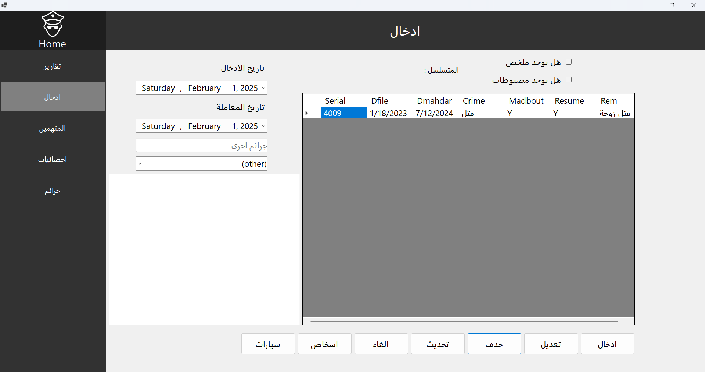
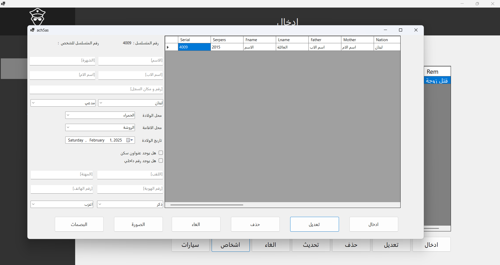
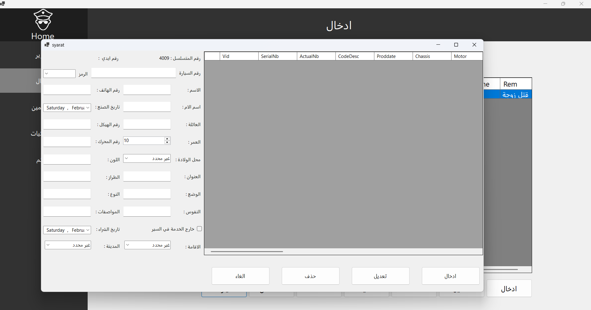
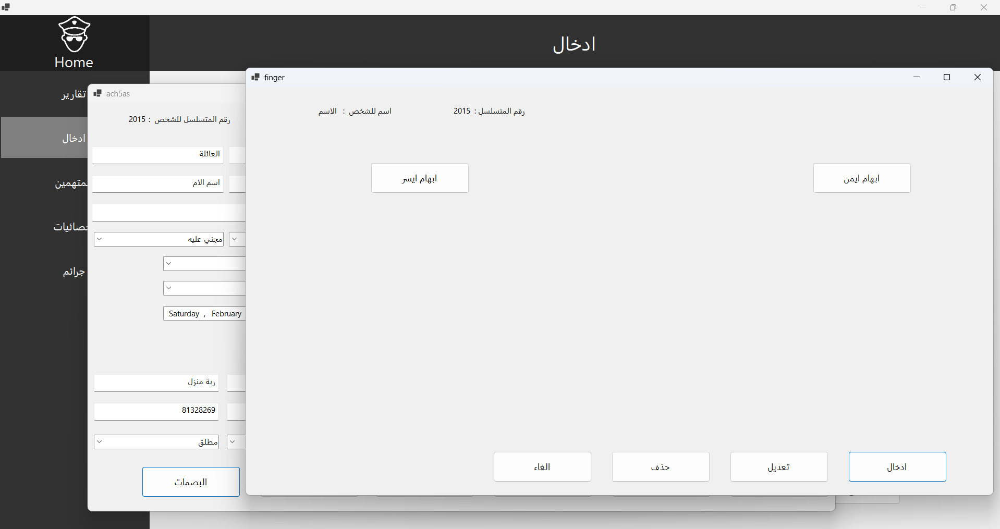

# police_station_management_system

## Description
The **Police Station Management System** is a Windows Forms application developed using **.NET Entity Framework** to manage a police station operations efficiently. It allows users to handle case records, officer assignments, criminal records, and complaint registrations through a user-friendly interface.

## Features
- **Case Management** (Add, Update, Close Cases)
- **Criminal Records** (Store and retrieve criminal history)
- **car Records** (Store and retrieve criminal history)
- **person Records** (Store and retrieve criminal history)
- **Database Integration** using **Entity Framework**

## Technologies Used
- **.NET Framework** (Windows Forms for UI)
- **C#** (Backend logic)
- **Entity Framework** (ORM for database operations)
- **SQL Server** (Database)

## Prerequisites:
- **Visual Studio** (Latest version with .NET Framework support)
- **SQL Server** (Express or Full version)
- **.NET Framework** (Ensure proper version installed)
  
## screenshot

